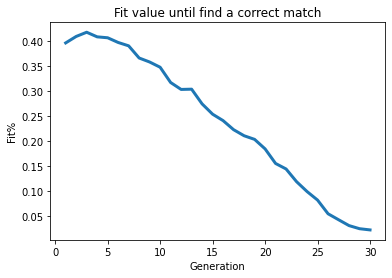
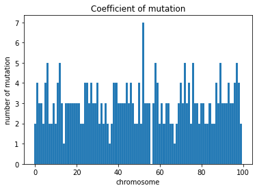
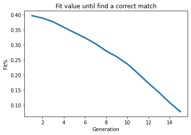
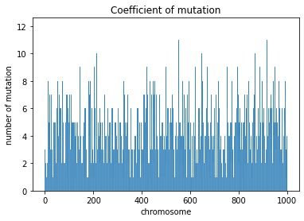
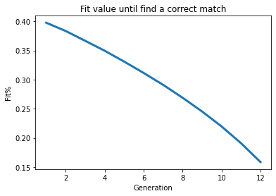
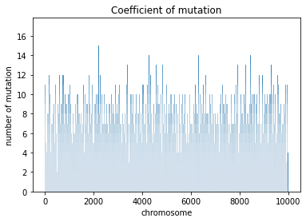
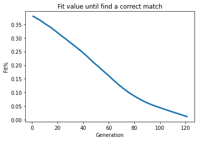
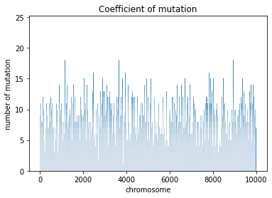

# ARTIFICIAL-INTELLIGENCE

Project Purpose
===============

Some $DNA$ $mutations$ are quiet and have no impact, but others
influence protein, which regulate whether the gene is active or not,
produces more or less protein or changes protein synthesis entirely. A
mutation is a change in a DNA sequence that is caused by either a
mistake during DNA replication or chemical damage. Genes are regions of
the genome that contain the instructions for the synthesis of protein
molecules, which perform the majority of the vital functions in cells.
Understanding the cause of a mutation of a certain section of DNA can
lead to understanding what happened during the history of protein
mutation. By constructing a $big$ $pool$ $of$ $string$ $of$ $Genes$,
this algorithm will be able to quickly identify what is likely the
protein where the mutation came from.

How it is done
==============

Genetic Algorithms are adaptive heuristic search algorithms that are a
subset of $evolutionary$ $algorithms$. These are clever exploitations of
random search given by historical data to lead the search into the
solution space area of greater performance. In other words, they
replicate \"survival of the fittest\" among individuals of successive
generations in order to solve a problem. Each generation is made up of a
population of individuals, with each individual representing a point in
the search space and a potential solution. Every person is represented
by a string of character/integer/float/bits. This string is similar to
the Chromosome.

Creation of The Population
==========================

For this part, it is really important to define a $optimal solution$ and
a $population$ that correspond to a list of $chromosome$ of the same
length of the optimal solution: $$population = {'AGTT', 'AGTT', ...}$$
$$chromosome = {'AGTT'}$$ $$optimal = {'ACCC'}$$

Fitness Function
================

Firstly, it has been noticed that each new generation has more
$superior$ $genes$ on average than the individual (solution) of prior
generations. As a result, each successive generation has better
$partial$ $answers$ than prior generations. This is translated in our
instance because we are mutating in the right way to discover a perfect
matching chromosome with the optimal solution. The underlying difficulty
with this fitness score function is that there is no standard method to
write it. Looking online, many researchers claim that writing a fitness
function is a really difficult task. However, there is one that works
the majority of the time, and it is the one that uses the absolute value
between each chromosome and the optimal solution.\

::: {#tab:my_label}
  --- ----
   A   65
   G   71
   T   84
   C   67
   U   85
  --- ----

  : ASCII code for nucleotides
:::

$$absolute = |A - G| = |65 - 71| = 6$$

Evolution
=========

Once the fitness function is defined, the next step is to conduct two
critical operations that allow the algorithm to develop without
assistance. The first operation that was developed was the $crossover$,
which consists in flipping a portion of two chromosomes by placing two
cross sites. This process is carried out on the chromosomes with the
highest $fitness$ $score$ using a $random$ $choice$ $probability$, such
that the next population generated is closer to the solution.\
$${'\textbf{AGTTCT}'}, {'ACCCTG'}$$ $$crossover index = {1:3}$$
$${'\textbf{A}CCC\textbf{CT}'},{'A\textbf{GTT}TG'}$$\
The other operation is called $mutation$, and it was one of the most
critical parameters to fix during the experiment since a high mutation
rate resulted in the failure to discover a solution. The new population
created, as a result, is just a random one of the previous population.
Meanwhile, by using a low mutation rate, the algorithm results in a
simple permutation because of/due to the crossover operation. As a
consequence, the Algorithm stops and it is not able to
reach any solution.\
$$'AGTCCTC' ---> '\textbf{C}GTCCT\textbf{A}'$$\

Algorithm
=========

1.  Define the optimal protein

2.  Create the population

3.  Define fitness score function

4.  Until does not find optimal protein:

    1.  Select 2 chromosomes based on their random choices probability

    2.  Perform crossover operation and mutation operation

    3.  place the 2 new chromosomes in the population

    4.  calculates the fitness for the population

Tools used in the project
=========================

What is used during the experiment:

-   vscode

-   [GitHub](https://github.com/Reevoc/ARTIFICIAL-INTELLIGENCE)

-   Python

-   Jupiter Notebook

Experiments
===========

It is possible to see how the experiment is carried out, by looking at
the table on the following pages. An optimal protein is chosen to locate
and test with a different kind of parameter. Two different types of
graphics are displayed for each experiment. The first demonstrates the
development of the learning trend and the approach to the answer epoch
after epoch. The other graphic demonstrates the variation between the
last population generated and the ideal protein that we gave at the
beginning. In particular, the difference from the ideal one increases
with the height of the histogram bar, the more is high the more is
different and vice-versa.

Future work
===========

In future work, it will be interesting to test this kind of algorithm in
real databases with well-known proteins and mutated ones. And see if the
populations generated are correlated in some way to the evolution of the
protein. Hence, it could be meaningful to understand the cause of
mutation and likely it happens over time.

   Experiment   Length Opt   Correct Epoch   Num Population   Max Dif Genes     time
  ------------ ------------ --------------- ---------------- --------------- -----------
      exp1          20            30              100             0.35          0.3s
      exp2          20            15              1000             0.6          1.7s
      exp3          20            12             10000            0.75         3m42.3s
      exp4         100            121            10000            0.24        38m 13.2s

References
==========

> \\bibliography{mybib.bib}
